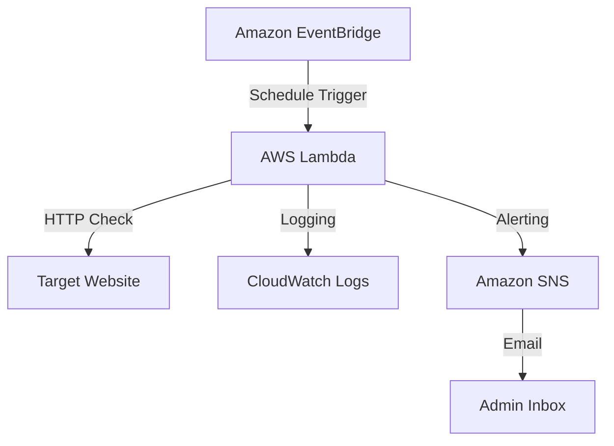
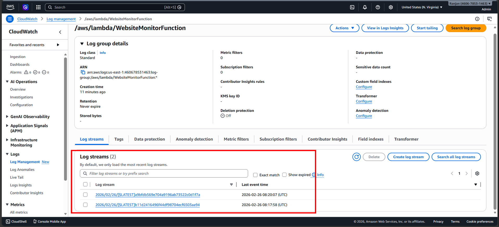
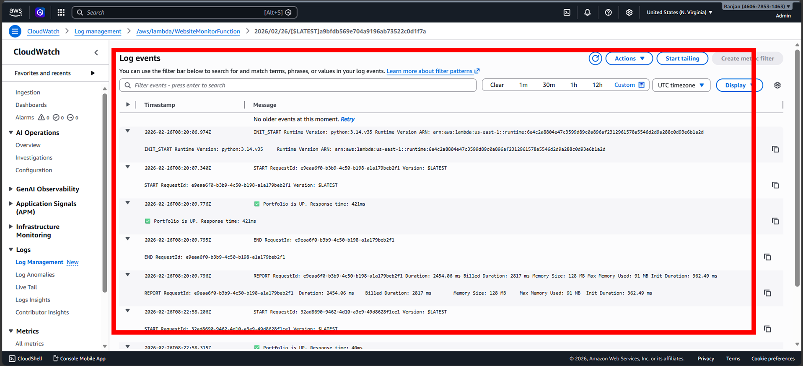
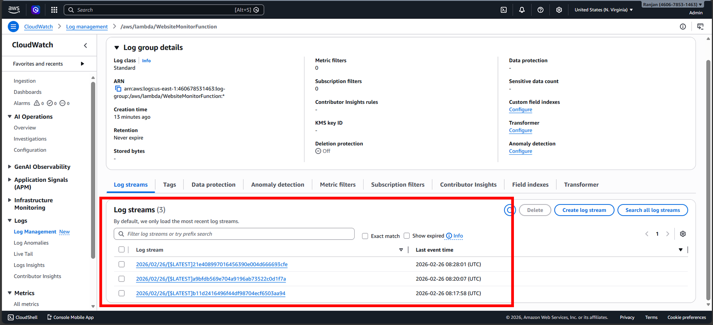
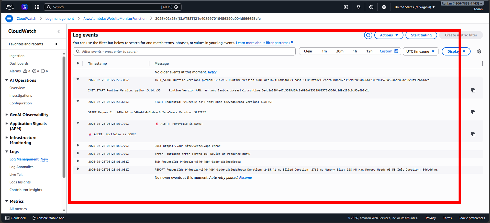
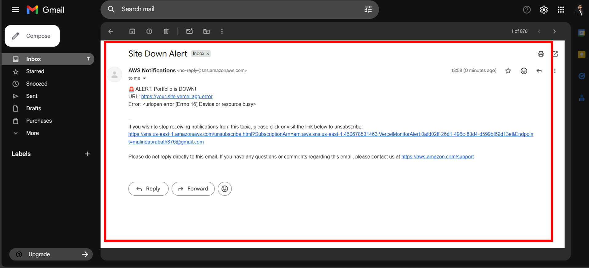

# 📡 AWS Serverless Website Monitoring & Alerting System

<div align="center">

**Enterprise-Grade Cloud Monitoring Solution** **Automated Health Checks | Real-Time Email Alerts | Serverless Infrastructure**


</div>

---

## 📋 Table of Contents
- [Project Overview](#-project-overview)
- [System Architecture](#-system-architecture)
- [Key Features](#-key-features)
- [Technology Stack](#-technology-stack)
- [What I Learned](#-what-i-learned)
- [Setup & Implementation (Step-by-Step)](#-setup--implementation-step-by-step)
- [Clone & Usage](#-clone--usage)
- [Contact & Support](#-contact--support)

---

## 🎯 Project Overview
This project is a **real-world AWS serverless monitoring system** built to continuously monitor website availability and response time. When a website goes **down** or becomes **slow**, the system automatically sends **instant alerts via Amazon SNS**.

The solution is **fully serverless**, meaning no servers to manage, highly scalable, and extremely cost-efficient, making it ideal for modern DevOps production environments.

✅ **Automated Checks** - Runs every 5 minutes using EventBridge.  
✅ **Serverless Power** - Built with AWS Lambda & Python.  
✅ **CI/CD Integrated** - Automated deployment via GitHub Actions.  
✅ **Real-Time Visibility** - Full logging and metrics via CloudWatch.

---

## 🏗️ System Architecture

### **Architecture Flow**



---

## ✨ Key Features
* **Event-Driven Monitoring**: No manual intervention needed; the system works 24/7.
* **Infrastructure as Code Ready**: Modular setup for AWS resources.
* **Security First**: Credential management using GitHub Secrets.
* **Cost Efficiency**: Runs within the AWS Free Tier.

---

## 🛠️ Technology Stack
| Technology | Role |
| :--- | :--- |
| **AWS Lambda** | Serverless compute to execute monitoring logic. |
| **Amazon SNS** | Simple Notification Service for email delivery. |
| **Amazon EventBridge** | Cron-job scheduler for automated triggers. |
| **Amazon CloudWatch** | Centralized logging and performance metrics. |
| **Python** | Core logic using Boto3 (AWS SDK). |
| **GitHub Actions** | Automated CI/CD pipeline for deployment. |

---

## 🔧 Setup & Implementation (Step-by-Step)

### **Step 01 – Create SNS Topic**
Creating the notification channel for downtime alerts.


---

### **Step 02 – Subscribe Email to SNS Topic**
Verifying the email endpoint to receive real-time notifications.


---

### **Step 03 – Create IAM Role**
Setting up granular permissions for Lambda to access SNS and CloudWatch.


---

### **Step 04 – Configuring GitHub Secrets (AWS Credentials)**
To enable automated deployment via GitHub Actions, you must securely store your AWS credentials as repository secrets.

1. Go to your **GitHub Repository** → **Settings**.
2. Click **Secrets and variables** → **Actions**.
3. Add **AWS_ACCESS_KEY_ID** and **AWS_SECRET_ACCESS_KEY**.


---

### **Step 05 – Create Lambda Function**
Provisioning the serverless compute resource.


---

### **Step 06 – Test Lambda Function**
Initial manual test execution to verify the Python logic.


---

### **Step 07 – Deploy Lambda Code Using Git Action**
Push-to-deploy automation in action via GitHub Actions pipeline.


---

### **Step 08 – Add Lambda Trigger**
Scheduling the monitoring interval via EventBridge (CloudWatch Events).


---

### **Step 09 – View CloudWatch Metrics**
Monitoring the health and invocation frequency of the monitoring system.


---

### **Step 10 – View CloudWatch Log Group**
Centralized logs showing every HTTP check performed by the system.


---

### **Step 11 – Status: Before Site Downtime**
Verifying logs during normal operations (Healthy State - 200 OK).



---

### **Step 12 – Status: After Site Downtime**
Observing how the system detects the failure and logs the error state.



---

### **Step 13 – Email Alert Received**
The final confirmation: Real-time downtime alert delivered via SNS.


---

## 🎓 What I Learned From This Project
* **Event-Driven Design**: Coordinating multiple AWS services into a seamless, automated workflow.
* **Serverless Operations**: Implementing production-grade monitoring without server maintenance.
* **CI/CD Mastery**: Bridging GitHub Actions with AWS for secure, rapid deployments.
* **Observability**: Leveraging CloudWatch for incident investigation and performance tracking.

---

## 🚀 Clone & Usage

```bash
# Clone the repository
git clone https://github.com/malinda6997/Serverless-Uptime-Monitor-with-AWS.git

# Navigate to project directory
cd Serverless-Uptime-Monitor-with-AWS
```

### **Quick Setup Summary**
1. **SNS**: Create topic and confirm email subscription.
2. **IAM**: Create role with specific SNS and CloudWatch write permissions.
3. **Lambda**: Create function and attach the created IAM role.
4. **Secrets**: Add AWS Access Keys to GitHub Secrets to enable CI/CD.

---

## 📈 Why This Project Is Important
* **Real-World Monitoring**: Demonstrates how to maintain high availability for cloud applications.
* **Industry Standards**: Uses production-grade AWS services (Lambda, SNS, CloudWatch).
* **DevSecOps Cycle**: Showcases a complete automated pipeline (Code -> Secure Secrets -> Deploy).

---

## 🔮 Future Improvements
* **Data Persistence**: Store uptime metrics in **Amazon DynamoDB** for long-term trend analysis.
* **Multi-Channel Alerts**: Integration with **Slack** or **Discord** using Webhooks.
* **Infrastructure as Code**: Implementing the entire setup using **Terraform** or **AWS CDK**.

---

## 📞 Contact & Support

**Malinda Prabath** 📧 **Email**: [malindaprabath876@gmail.com](mailto:malindaprabath876@gmail.com)  
📱 **Phone**: 0762206157  
💼 **Profile**: Cloud & DevOps Enthusiast

<div align="center">
Built with 💻 and ☁️ AWS | 2026
</div>