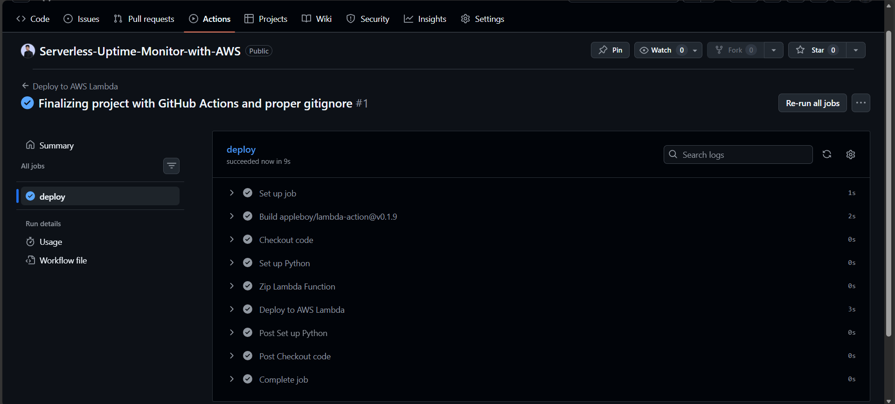

# 📡 AWS Serverless Website Monitoring & Alerting System

## 📌 Project Overview
This project is a **real-world AWS serverless monitoring system** built to continuously monitor website availability and response time.
When a website goes **down** or becomes **slow**, the system automatically sends **alerts via Amazon SNS**.

The solution is **fully serverless**, scalable, and cost-efficient, making it suitable for production use and DevOps/Cloud portfolios.

---

## 🏗️ System Architecture

### Architecture Flow
```

Amazon EventBridge (Schedule)
|
v
AWS Lambda (Python)
|
|----> Amazon CloudWatch Logs
|
|----> Amazon SNS (Email Alerts)

```

### Architecture Explanation
- EventBridge triggers Lambda at fixed intervals
- Lambda checks website status and response time
- CloudWatch stores logs
- SNS sends alerts when issues are detected

---

## 🌍 Real-World Use Cases
- Website uptime monitoring
- Production health checks
- Startup MVP monitoring
- DevOps automation
- Cloud / DevOps portfolio project

---

## ⚙️ Technologies Used
- AWS Lambda
- Amazon EventBridge
- Amazon SNS
- Amazon CloudWatch
- Python
- GitHub Actions
- Vercel-hosted website (monitored target)

---

## 🧠 What I Learned From This Project
- Designing event-driven serverless architectures
- Monitoring real systems using AWS Lambda
- Implementing alerting mechanisms with SNS
- Analyzing logs using CloudWatch
- Writing production-ready Python code
- Understanding serverless cost efficiency

---

## 📁 Project Structure
```

aws-serverless-monitor-project-01/
├── lambda_function.py
├── README.md   
└── .gitignore

````

---

## 🔧 Setup & Implementation (Step-by-Step)

### Step 01 – Create SNS Topic


---

### Step 02 – Subscribe Email to SNS Topic


---

### Step 03 – Create IAM Role


---

### Step 04 – Configuring GitHub Secrets (AWS Credentials)
To enable automated deployment via GitHub Actions, you must securely store your AWS credentials as repository secrets. This ensures your keys are never exposed in the source code.

Follow these steps to add secrets:

- Go to your GitHub Repository → Settings.
- On the left sidebar, click Secrets and variables → Actions.
- Click the New repository secret button.
Add the following secrets one by one:


---

### Step 05 – Create Lambda Function


---

### Step 06 – Test Lambda Fuction


---

### Step 07 – Deploy Lambda Code Using Git Action


---

### Step 08 – Configure Website URLs


---

### Step 09 – Add SNS Topic ARN


---

### Step 10 – Save & Deploy Lambda


---

### Step 11 – Enable CloudWatch Logging


---

### Step 12 – View CloudWatch Log Group


---

### Step 13 – Create EventBridge Rule


---

### Step 14 – Configure Schedule


---

### Step 15 – Set Lambda as Target


---

### Step 16 – Rule Enabled


---

### Step 17 – Website Running Normally


---

### Step 18 – Normal Execution Logs


---

### Step 19 – Website Goes Down


---

### Step 20 – Downtime Detected in Logs


---

### Step 21 – SNS Alert Triggered


---

### Step 22 – Email Alert Received


---

### Step 23 – Website Restored


---

### Step 24 – Recovery Logged


---

### Step 25 – Performance Monitoring


---

### Step 26 – Slow Response Detection


---

### Step 27 – Latency Alert


---

### Step 28 – GitHub Repository Setup


---

### Step 29 – GitHub Actions Workflow


---

### Step 30 – Final Project Verification


---

## 🚀 Clone & Setup Instructions

```bash
git clone https://github.com/malinda6997/Serverless-Uptime-Monitor-with-AWS/tree/main
````

### Setup Summary

1. Create SNS topic
2. Create Lambda function
3. Paste monitoring code
4. Configure EventBridge schedule
5. Test downtime & alerts

---

## 📈 Why This Project Is Important

* Demonstrates real-world cloud monitoring
* Uses production-grade AWS services
* Fully serverless and scalable
* Strong DevOps / Cloud portfolio project

---

## 🔮 Future Improvements

* Store metrics in DynamoDB
* Slack / Discord alerts
* Terraform or AWS CDK deployment
* CloudWatch dashboards

---

## 👤 Author

**Malinda**
AWS Serverless Monitoring Project

```

---
